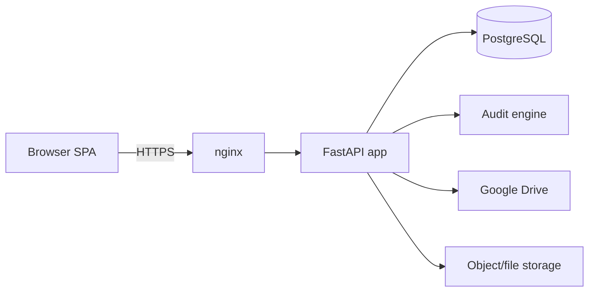

# Payroll Panel — From-Zero Rebuild Plan

## Recommended stack (and why)

- **Backend: Python + FastAPI.** Keep Python because the core value — the Excel audit engine (`farm_payroll_audit.py`, `fertilizer_audit.py`), `openpyxl` workbook highlighting, and the Google Drive integration — is already Python. Rewriting that in JS/TS (the Next.js option) would be the riskiest, highest-effort path with no benefit. FastAPI stays, but restructured from one 1100-line file into a proper package.
- **Database: PostgreSQL + SQLAlchemy 2.0 + Alembic.** Replace the fragile JSON files (`data/index.json`, `users.json`, `sessions.json`) with a real DB. JSON files have no concurrency safety, no transactions, and no query/reporting ability.
- **Frontend: keep it simple but component-based.** The current 3 static HTML files work but are unmaintainable. Recommend a light Vite + React (or Vue) SPA talking to the JSON API. A full Next.js frontend is optional and only worth it if SEO/SSR matter (they don't for an internal RTL admin panel).
- **Deployment: Docker + docker-compose.** One `web` container (FastAPI/uvicorn+gunicorn), one `db` (Postgres), one `nginx` reverse proxy. Portable across a VPS or any managed host, reproducible, and easy to hand off. This supersedes the current systemd/`install.sh` approach.



## Key problems in the current build to fix

- **Auth is duplicated and inconsistent:** both a JWT system (`create_token`/`decode_token`, lines ~80-104) and a cookie-session system (`_load_sessions`, lines ~179-203) exist. Pick one. Recommend httpOnly cookie sessions backed by DB (simplest for an internal panel) OR JWT access + refresh — not both.
- **Weak password hashing:** `_hash_password` uses bare `sha256` (line ~159). Replace with `bcrypt`/`argon2` via `passlib`.
- **Hardcoded secrets/PINs:** `JWT_SECRET = "change-me-in-production-bzhz1405"` and `PIN = "behzadian1405"` (lines ~57-61). Move all secrets to env/`.env` with no insecure defaults.
- **Hardcoded external paths:** `/root/.hermes/...` in `drive_sync.py` and `bootstrap_drive.py` — not portable. Vendor the audit + Drive scripts into the repo as a package.
- **No tests, no migrations, no input validation** beyond ad hoc checks; request bodies are raw `dict`. Use Pydantic models everywhere.

## Target architecture

```
payroll-panel/
  app/
    main.py                 # FastAPI app factory, router registration
    config.py                # pydantic-settings, env-driven
    db.py                    # engine/session
    models/                  # SQLAlchemy: User, Session, Upload, AuditRun, Report
    schemas/                 # Pydantic request/response models
    api/
      auth.py                # login/logout/me + user CRUD (accountant-only)
      uploads.py              # payroll xlsx upload -> audit -> Drive backup
      reports.py              # foreman / well reports
      fertilizer.py           # fertilizer upload + reports
      chat.py                  # existing chat feature
    services/
      auth_service.py         # hashing, sessions, RBAC
      audit_service.py        # wraps farm_payroll_audit / fertilizer_audit
      drive_service.py        # Google Drive backup (vendored, path-configurable)
      storage_service.py      # local/S3-compatible file storage
    core/
      security.py             # password hashing, dependency-injected auth guards
  audit_engine/               # vendored former ~/.hermes scripts
  migrations/                 # Alembic
  frontend/                   # Vite + React SPA (RTL, Persian)
  tests/
  docker-compose.yml
  Dockerfile
  pyproject.toml
```

## Data model (replaces JSON files)

- `users` (id, username, password_hash, role, name, created_at) — replaces `users.json`.
- `sessions` (token, user_id, created_at, expires_at) — replaces `sessions.json`; or drop entirely if going pure-JWT.
- `uploads` (id, month_key, type[payroll|fertilizer], original_name, sha256, stored_path, drive_file_id, uploaded_by, created_at) — replaces `index.json`/`fertilizer_index.json`.
- `audit_runs` / `issues` (linked to upload) so reports become DB queries instead of re-parsing files.

## Phased execution

1. **Scaffold & config** — `pyproject.toml`, app factory, pydantic-settings, Dockerfile + compose (Postgres, web, nginx), `.env.example`.
2. **Database layer** — SQLAlchemy models, Alembic baseline migration, seed script for the two default roles.
3. **Auth & RBAC** — single auth scheme, `passlib` hashing, FastAPI dependency guards (`require_role`), user CRUD endpoints. Port routes at `app.py` lines ~236-339.
4. **Vendor audit + Drive** — move `~/.hermes` audit/Drive scripts into `audit_engine/` and `services/drive_service.py`; make paths config-driven.
5. **Uploads & audit flow** — port `/api/upload` (line ~479) and `/api/fertilizer/upload` (line ~964): validate xlsx, hash, run audit, write highlighted workbook, back up to Drive, persist to DB.
6. **Reports & months** — port `/api/months`, `/api/reports/*`, `/api/archive`, download endpoints as DB-backed queries.
7. **Chat** — port `/api/chat` (line ~722) and history.
8. **Frontend** — Vite + React RTL SPA replacing `index.html`/`operator.html`/`login.html`; role-based views (operator vs accountant).
9. **Tests & CI** — pytest for services + API (auth, upload, audit, RBAC); GitHub Actions running lint + tests.
10. **Deploy** — compose up behind nginx with TLS; document env vars and Drive credential setup.

## Notes / decisions

- Recommending FastAPI+Postgres over Next.js specifically to avoid rewriting the Excel/Drive/audit logic.
- Recommending Docker over bare systemd for reproducibility and easy handoff; a systemd unit can still be generated if no Docker is preferred.
- Frontend framework (React vs Vue vs plain HTML+HTMX) is flexible — React assumed; can switch to HTMX to keep it near-zero-JS if a minimal footprint is wanted.

## Todos

- [ ] Scaffold FastAPI package, pyproject.toml, pydantic-settings config, Dockerfile + docker-compose (web, postgres, nginx), .env.example
- [ ] Add SQLAlchemy models (User, Session, Upload, AuditRun, Issue), Alembic baseline migration, and role seed script replacing JSON files
- [ ] Implement single auth scheme with passlib hashing, DB-backed sessions/JWT, RBAC dependency guards, and user CRUD endpoints
- [ ] Vendor the ~/.hermes audit and Google Drive scripts into audit_engine/ and services with config-driven paths
- [ ] Port payroll and fertilizer upload+audit flow: validate xlsx, hash, run audit, write highlighted workbook, Drive backup, persist to DB
- [ ] Port months/reports/archive/download endpoints as DB-backed queries
- [ ] Port chat and chat history endpoints
- [ ] Build Vite + React RTL SPA with role-based operator/accountant views replacing static HTML
- [ ] Add pytest suite (auth, RBAC, upload, audit) and GitHub Actions CI for lint + tests
- [ ] Deploy via docker-compose behind nginx with TLS; document env vars and Drive credential setup
